<p align="center">
  
</p>

<p align="center">
  <picture>
    <source media="(prefers-color-scheme: dark)" srcset="https://readme-typing-svg.demolab.com?font=Geist&amp;weight=700&amp;size=30&amp;duration=2800&amp;pause=1800&amp;color=67E8F9&amp;background=00000000&amp;center=true&amp;vCenter=true&amp;width=820&amp;height=60&amp;lines=I+build+apps+people+actually+use.;I+build+mobile+experiences.;I+build+full-stack+tools.;I+build+blockchain+apps." />
    <source media="(prefers-color-scheme: light)" srcset="https://readme-typing-svg.demolab.com?font=Geist&amp;weight=700&amp;size=30&amp;duration=2800&amp;pause=1800&amp;color=0369A1&amp;background=00000000&amp;center=true&amp;vCenter=true&amp;width=820&amp;height=60&amp;lines=I+build+apps+people+actually+use.;I+build+mobile+experiences.;I+build+full-stack+tools.;I+build+blockchain+apps." />
    
  </picture>
</p>

<p align="center">
  <a href="https://github.com/joelograsso?tab=followers"></a>
  
  
</p>

## `> whoami` 👋

<!-- Animated source recovered from the supplied still: https://tenor.com/view/typing-cat-gif-21351970 -->


I'm **Joe LoGrasso**—a builder who likes turning ambitious ideas into working products. This profile is a living build log for my public repositories, current experiments, open-source contributions, and the technologies I learn along the way.

- 🔭 Current experiments span mobile apps, applied AI, creative audio, games, finance, and local-first software
- 🧬 Co-author of the 2024 [OmicNavigator paper](https://link.springer.com/article/10.1186/s12859-024-05743-4) in *BMC Bioinformatics*
- 🛠️ Strongest when a project spans product design, polished interfaces, APIs, data, and infrastructure
- 💬 Deep-diving into React Native, TypeScript, Rust, Web Audio, computer vision, and deterministic AI guardrails

<br clear="right" />

```text
current_mode  = shipping apps people actually use
favorite_path = idea → prototype → resilient system → delightful product
curious_about = local-first software, applied AI, creative computing, human behavior
```

## `> gh stats --live` 📈

<p align="center">
  <picture>
    <source media="(prefers-color-scheme: dark)" srcset="https://github-profile-summary-cards.vercel.app/api/cards/profile-details?username=joelograsso&theme=github_dark" />
    <source media="(prefers-color-scheme: light)" srcset="https://github-profile-summary-cards.vercel.app/api/cards/profile-details?username=joelograsso&theme=default" />
    
  </picture>
</p>

<p align="center">
  <picture>
    <source media="(prefers-color-scheme: dark)" srcset="https://github-profile-summary-cards.vercel.app/api/cards/stats?username=joelograsso&theme=github_dark" />
    <source media="(prefers-color-scheme: light)" srcset="https://github-profile-summary-cards.vercel.app/api/cards/stats?username=joelograsso&theme=default" />
    
  </picture>
</p>

<p align="center">
  <picture>
    <source media="(prefers-color-scheme: dark)" srcset="https://github-readme-activity-graph.vercel.app/graph?username=joelograsso&bg_color=020617&color=94A3B8&line=38BDF8&point=A78BFA&area=true&area_color=0C4A6E&border_color=1E293B&radius=16" />
    <source media="(prefers-color-scheme: light)" srcset="https://github-readme-activity-graph.vercel.app/graph?username=joelograsso&bg_color=F8FAFC&color=334155&line=0284C7&point=7C3AED&area=true&area_color=BAE6FD&border_color=CBD5E1&radius=16" />
    
  </picture>
</p>

<picture>
  <source media="(prefers-color-scheme: dark)" srcset="https://raw.githubusercontent.com/joelograsso/joelograsso/output/github-contribution-grid-snake-dark.svg" />
  <source media="(prefers-color-scheme: light)" srcset="https://raw.githubusercontent.com/joelograsso/joelograsso/output/github-contribution-grid-snake.svg" />
  
</picture>

## `> ls ./workbench` 🔭

| Project | Why it matters |
| --- | --- |
| [**Music Light Visualizer**](https://github.com/joelograsso/music-light-visualizer) 🎧 | A browser light show that looks ahead through a track and reacts to beats, drops, energy, and structural transitions.<br><sub>Next.js · TypeScript · Web Audio · Canvas · essentia.js</sub> |
| **Snowball** ❄️ | A calm, voice-first journal and habit companion with forgiving progress and weekly recap letters written from your own data.<br><sub>Expo · React Native · Supabase · Claude · Deepgram</sub> |
| **Track.it** 🍜 | Nutrition logging from barcodes, photos, recipes, and social-video imports—one typed API from capture to mobile UI.<br><sub>Expo · Express · OpenAPI · Supabase · Vision/LLM APIs</sub> |
| **Four Eyes** 👓 | A first-person horror game where a near-sighted player searches a procedurally generated mansion for their glasses—and a way out.<br><sub>Unity · C# · URP · procedural generation · dynamic NavMesh</sub> |
| **SkinCair** 🫧 | A privacy-minded skin scan that builds deterministic, conflict-checked AM/PM routines with explicit safety guardrails.<br><sub>Expo · TypeScript · Supabase · Claude Vision · Vitest</sub> |
| **Home Contents Inventory** 🏠 | Photograph a room, detect and price insurable belongings, then confirm them in a keyboard-first visual review workspace.<br><sub>Next.js · Gemini · Supabase · TypeScript · Vitest</sub> |

<sub>Some workbench projects are still being built in private; the descriptions above reflect working local implementations, not vaporware.</sub>

### Open-source signal 📡

I added Plotly support to [OmicNavigator](https://github.com/abbvie-external/OmicNavigator/pull/9) and its [example study](https://github.com/abbvie-external/OmicNavigatorExample/pull/1). Both contributions were merged, and that work grew into a co-authorship on the project's peer-reviewed paper.

## `> cat stack.json` 🧰

**Languages I've shipped, studied, or built substantial projects with**

<p>
  
  
  
  
  
  
  
  
  
  
  
  
  
</p>

**The tools I reach for most**

<p>
  
  
  
  
  
  
  
  
  
  
  
  
  
  
  
  
  
  
</p>

## `> git log --project-history --reverse` 🧭

| When | How the stack evolved |
| --- | --- |
| **2019–20** | Started with Python, algorithms, data structures, and small public experiments. |
| **2021** | Moved into R, interactive data visualization, Plotly, reusable data models, and open-source contribution. |
| **2022** | Built full-stack systems with Java, Spring Boot, React, REST APIs, and MongoDB. |
| **2023–24** | Expanded from HTML/CSS/JavaScript into modern React products, Python automation, analytics, and published open-source work. |
| **2025** | Went deeper on TypeScript, PostgreSQL, Docker, Rust/Axum, and Solana while building the NFTix platform. |
| **2026 → now** | Running a broad product lab across Expo, Supabase, applied AI, Web Audio, Unity, computer vision, and local-first data. |

## `> cat /etc/personality` 🌎

When I'm away from a keyboard: **hockey** 🏒 · **hiking** 🥾 · **skiing** ⛷️ · **football** 🏈 · **golf** ⛳ · **travel** ✈️ · **astronomy** 🔭

<p align="center">
  <strong>Build → measure → learn → repeat.</strong><br />
  <a href="https://github.com/joelograsso?tab=repositories">Explore the repositories and follow the next experiment.</a>
</p>

<p align="center"><sub>Designed with curiosity, caffeine, and a suspicious number of side projects.</sub></p>
